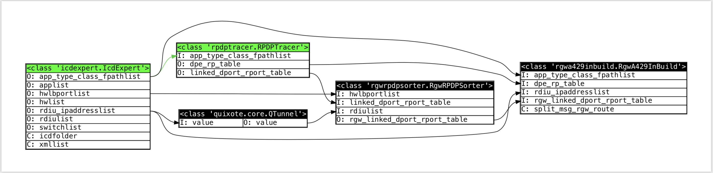

Quixote is a minimal dataflow based computational graph skeleton library

It provides you a clean and right-thinking data processing paradigm.

In data processing, we concern about three things:
1. Where is the data came from
2. What is the purpose of the data
3. Where is the destination of data

So quixote's graph consists of two things, Node and Bind, Node is in which the data is transformed, Bind binds two nodes' data interface into pipeline.
And quixote's dataflow graph is like below.
(image is powered by graphviz, rectangle represents Node, and data Bind is presented by arrowed spline, green ones are updated with newest data feed, this image is from one real airplane system project I'm leading)

___In the quixote dataflow graph, left node(or forward nodes) is data feed of right linked ones. Once left node is updated successfully, it will output and push its newest result into linked node's input. When one node's forward, or "data dependent nodes", all updated successfully (newest data feed is ready), this node will try to update itself's output with respect to the newest data inputs. The `update` function is user defined, quixote graph will call it on evaluation time in data dependency order. When node's `update` function is called, quixote will make sure that all it's data inputs are updated and ready to be read. All the node should do is take different sources of data and calculate or transform input data and put them into its outputs. (Tunnel is a simple node takes one input and transform into one output, it helps graph more self explainable when node's input takes single specific data over a large amount of complex data with a lot of redundant information, I mean if our data interface is opaque, how can we expect node's behavior from that?)___

> Be noticed that you should not change forward node's input data, it is possible to but quite an undefined behavior.

# WHY? 

You must have question like "WHY WE BOTHER DO THIS"?

Let me list some of advantages comes with quixote's data processing paradigm.

* Data Lineage is sound and clear
* Focus on data interface makes user rethink about design of architecture 
* Debug is more painless than if I have a junk of codes and I have no idea what's are going on
* Nodes provide nature variable scope isolation which makes functions purer and unsurprised
* Errors can be caught easily, and not interfere other nodes' functions when they have no dependency
* Refactoring should be quick and easy
* MOST IMPORT ONE - New project team member could immediately participate in development
* ...

It would be unfair if I don't list some shortages.

* At present quixote.core is written in python
* It _force_ you to write code in specific way rather than a powerful and unconstrained style you are thinking of.


# Installation

You could get quixote by pip.
``` 
pip install pyquixote
```

Graphviz library is optional, if you want to visualize the data graph please install `graphviz`

It is recommanded to use `anaconda` for `graphviz` installation and development.

```
conda install graphviz
```
This will install `graphviz` c library into anaconda environment
```
pip install graphviz
```
And this will install `graphviz` python binding package

> You may found some additional operation like enviroment variable settings on Windows operation system. If you have any further question about how to install `graphviz` please refer to:

* [https://pypi.org/project/graphviz/](https://pypi.org/project/graphviz/)
* [https://graphviz.readthedocs.io/en/stable/manual.html](https://graphviz.readthedocs.io/en/stable/manual.html)
* [https://stackoverflow.com/questions/18438997/why-is-pydot-unable-to-find-graphvizs-executables-in-windows-8](https://stackoverflow.com/questions/18438997/why-is-pydot-unable-to-find-graphvizs-executables-in-windows-8)

# Usage


